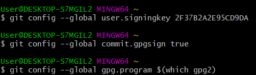
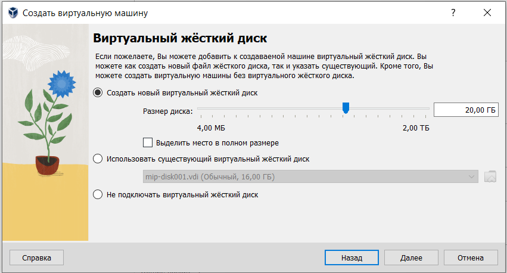
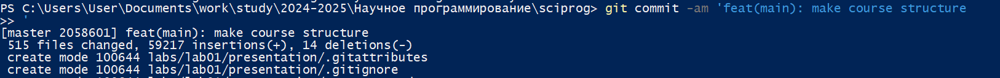
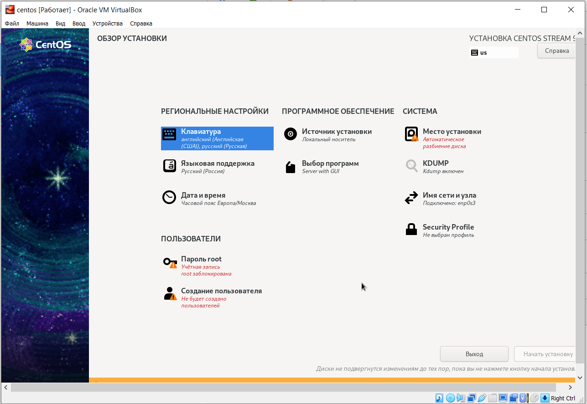
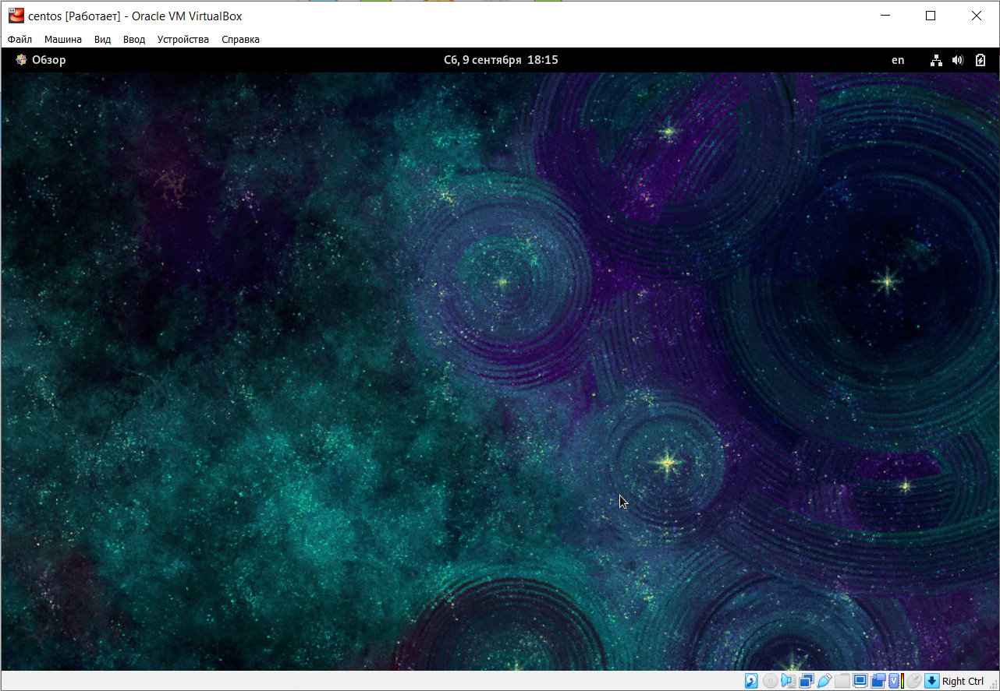
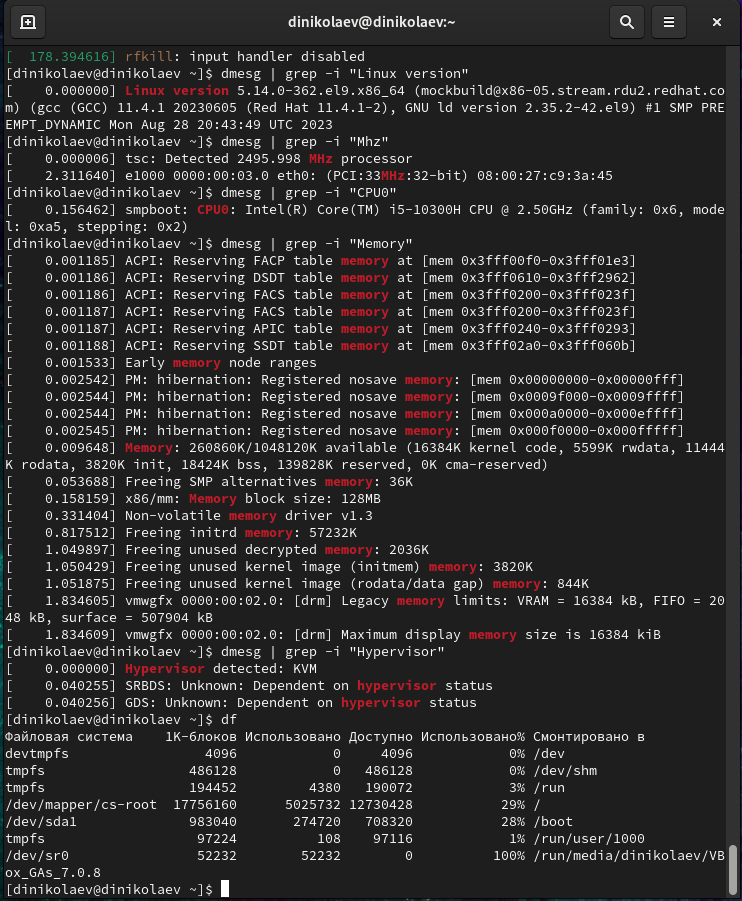

---
## Front matter
lang: ru-RU
title: Лабораторная работа №1
subtitle: Информационная безопасность
author:
  - Николаев Дмитрий Иванович
institute:
  - Российский университет дружбы народов, Москва, Россия
group:
  - НКНбд-01-20

## i18n babel
babel-lang: russian
babel-otherlangs: english

## Formatting pdf
toc: false
toc-title: Содержание
slide_level: 2
aspectratio: 169
section-titles: true
theme: metropolis
header-includes:
 - \metroset{progressbar=frametitle,sectionpage=progressbar,numbering=fraction}
 - '\makeatletter'
 - '\beamer@ignorenonframefalse'
 - '\makeatother'
---

# Прагматика выполнения

- Получение знаний об установке ОС CentOS Linux.
- Просмотр базовой информации о системе
 
# Цель

Приобретение практических навыков установки операционной системы на виртуальную машину, настройки минимально необходимых для дальнейшей работы сервисов.

# Задачи

1. Установить ОС CentOS Linux.

2. Вывести различную информацию о системе.

# Выполнение работы

## Оперативная память

## Жесткий диск

## Установка образа

## Обзор установки

## Рабочий стол

## Информация о системе

# Результаты

В ходе работы я приобрёл навыки установки операционной системы CentOS Linux на виртуальную машину и просмотрел некоторую информацию о системе.
