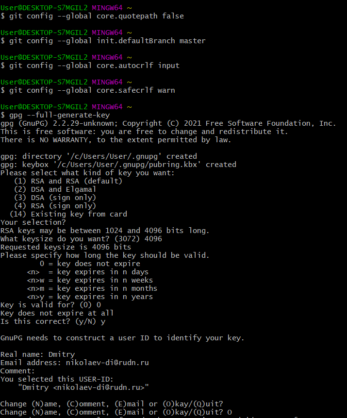
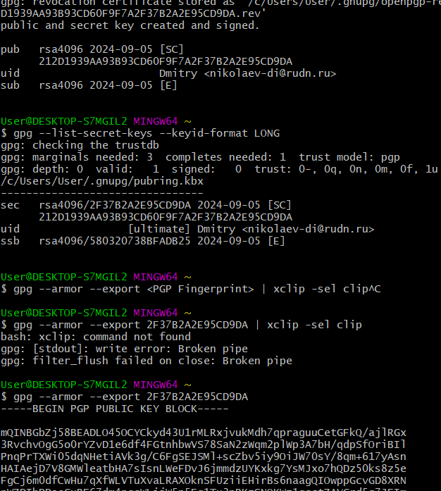
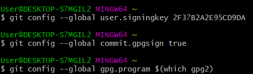
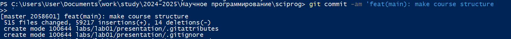
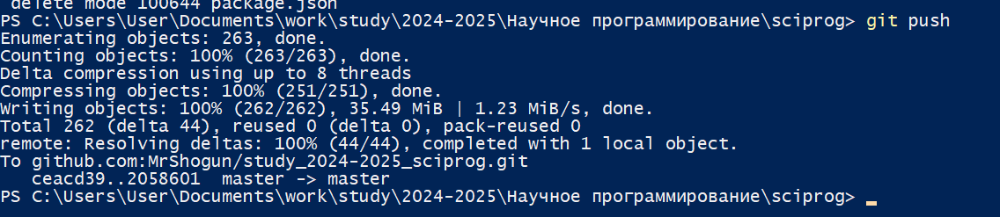
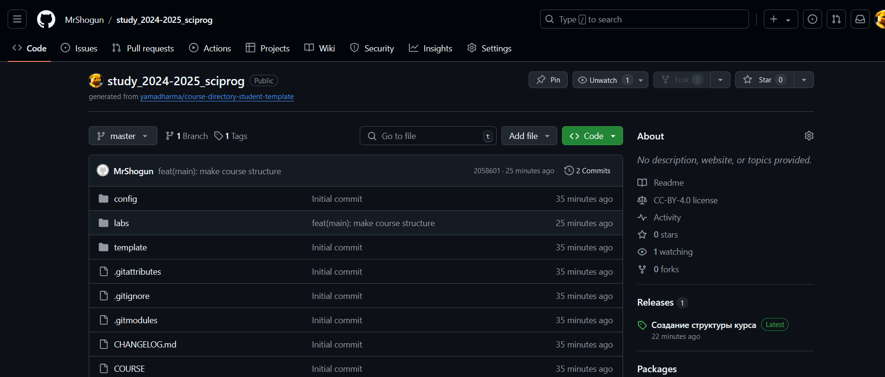

---
## Front matter
title: "Лабораторная работа №1"
subtitle: "Информационная безопасность"
author: "Николаев Дмитрий Иванович"

## Generic otions
lang: ru-RU
toc-title: "Содержание"

## Bibliography
bibliography: bib/cite.bib
csl: pandoc/csl/gost-r-7-0-5-2008-numeric.csl

## Pdf output format
toc: true # Table of contents
toc-depth: 2
lof: true # List of figures
lot: true # List of tables
fontsize: 12pt
linestretch: 1.5
papersize: a4
documentclass: scrreprt
## I18n polyglossia
polyglossia-lang:
  name: russian
  options:
	- spelling=modern
	- babelshorthands=true
polyglossia-otherlangs:
  name: english
## I18n babel
babel-lang: russian
babel-otherlangs: english
## Fonts
mainfont: PT Serif
romanfont: PT Serif
sansfont: PT Sans
monofont: PT Mono
mainfontoptions: Ligatures=TeX
romanfontoptions: Ligatures=TeX
sansfontoptions: Ligatures=TeX,Scale=MatchLowercase
monofontoptions: Scale=MatchLowercase,Scale=0.9
## Biblatex
biblatex: true
biblio-style: "gost-numeric"
biblatexoptions:
  - parentracker=true
  - backend=biber
  - hyperref=auto
  - language=auto
  - autolang=other*
  - citestyle=gost-numeric
## Pandoc-crossref LaTeX customization
figureTitle: "Рис."
tableTitle: "Таблица"
listingTitle: "Листинг"
lofTitle: "Список иллюстраций"
lotTitle: "Список таблиц"
lolTitle: "Листинги"
## Misc options
indent: true
header-includes:
  - \usepackage{indentfirst}
  - \usepackage{float} # keep figures where there are in the text
  - \floatplacement{figure}{H} # keep figures where there are in the text
---

# Цель работы

Приобретение практических навыков установки операционной системы CentOS RedHat на виртуальную машину и настройка минимально необходимого окружения для дальнейшей работы.

# Ход работы

Следуем указаниям из [@lab1]. Создаем виртуальную машину в VirtualBox.

Устанавливаем имя пользователя с паролем.

Устанавливаем оперативную память и число процессоров.

Создаем новый динамический виртуальный жесткий диск и задаем его размер.

В VirtualBox добавляем новый привод оптических дисков, где выбираем заранее скачанный образ выбранной операционной системы.

После этого запускаем виртуальную машину и начинаем установку ОС.

Настройка параметров установки:

После выполнения данных шагов мы попадаем на рабочий стол нашей виртуальной машины.

Далее подключаем образ диска дополнительной гостевой ОС.

Получим с помощью команды dmesg | grep -i некоторую информацию о системе. Последовательно выведем версию ядра Linux, частоту процессора, модель процессора, объем доступной оперативной памяти, тип обнаруженного гипервизора, тип файловой системы корневого раздела.

# Выводы

В ходе выполнения данной лабораторной работы я приобрёл навыки установки операционной системы CentOS Linux на виртуальную машину.

# Список литературы{.unnumbered}

::: {#refs}
:::
