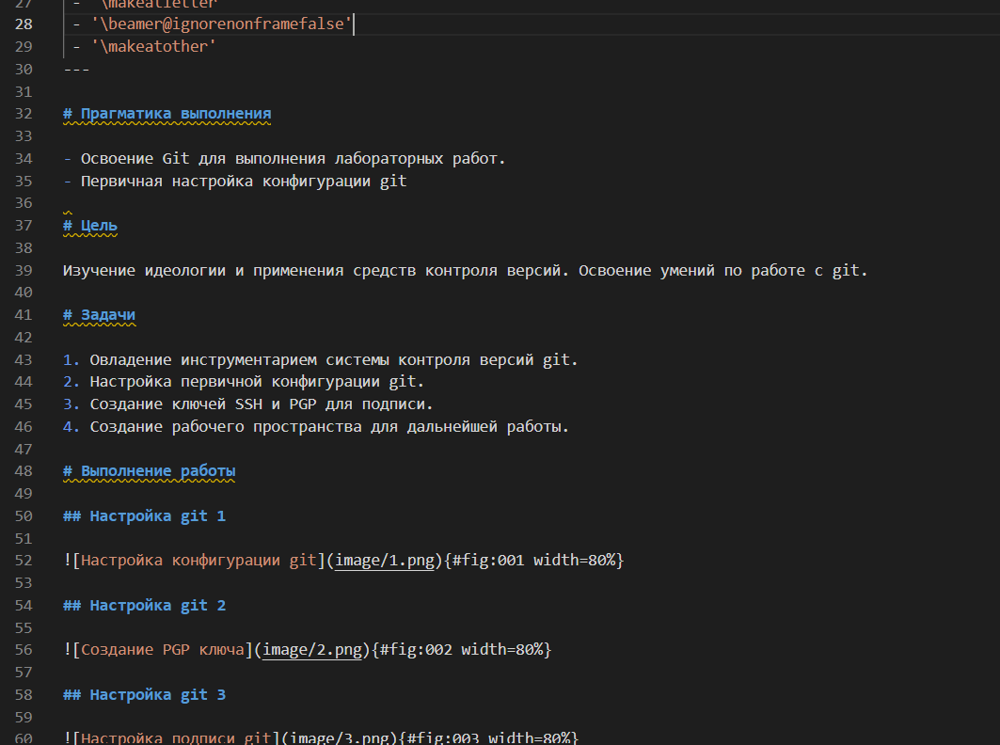

---
## Front matter
title: "Лабораторная работа №2"
subtitle: "Информационное моделирование"
author: "Николаев Дмитрий Иванович"

## Generic otions
lang: ru-RU
toc-title: "Содержание"

## Bibliography
bibliography: bib/cite.bib
csl: pandoc/csl/gost-r-7-0-5-2008-numeric.csl

## Pdf output format
toc: true # Table of contents
toc-depth: 2
lof: true # List of figures
lot: true # List of tables
fontsize: 12pt
linestretch: 1.5
papersize: a4
documentclass: scrreprt
## I18n polyglossia
polyglossia-lang:
  name: russian
  options:
	- spelling=modern
	- babelshorthands=true
polyglossia-otherlangs:
  name: english
## I18n babel
babel-lang: russian
babel-otherlangs: english
## Fonts
mainfont: PT Serif
romanfont: PT Serif
sansfont: PT Sans
monofont: PT Mono
mainfontoptions: Ligatures=TeX
romanfontoptions: Ligatures=TeX
sansfontoptions: Ligatures=TeX,Scale=MatchLowercase
monofontoptions: Scale=MatchLowercase,Scale=0.9
## Biblatex
biblatex: true
biblio-style: "gost-numeric"
biblatexoptions:
  - parentracker=true
  - backend=biber
  - hyperref=auto
  - language=auto
  - autolang=other*
  - citestyle=gost-numeric
## Pandoc-crossref LaTeX customization
figureTitle: "Рис."
tableTitle: "Таблица"
listingTitle: "Листинг"
lofTitle: "Список иллюстраций"
lotTitle: "Список таблиц"
lolTitle: "Листинги"
## Misc options
indent: true
header-includes:
  - \usepackage{indentfirst}
  - \usepackage{float} # keep figures where there are in the text
  - \floatplacement{figure}{H} # keep figures where there are in the text
---

# Цель работы

Получение практических навыков работы в консоли с атрибутами файлов, закрепление теоретических основ дискреционного разграничения доступа в современных системах с открытым кодом на базе ОС Linux.

# Выполнение лабораторной работы  

Выполняем задания согласно указаниям [@lab2].

1. В установленной при выполнении предыдущей лабораторной работы операционной системе используем учётную запись администратора и создаём нового пользователя guest с помощью команды: useradd guest ([@fig:001])

    {#fig:001 width=70%}

2. Задаём пароль для пользователя guest (используя учётную запись администратора): passwd guest ([@fig:002])

    {#fig:002 width=70%}

3. Войдём в систему от имени пользователя guest ([@fig:003]).

    {#fig:003 width=70%}

4. Определим директорию, в которой сейчас находимся. Для пользователя guest она является домашней и совпадает с приглашением командной строки ([@fig:004]).

    {#fig:004 width=70%}

5. Уточняем имя пользователя: whoami ([@fig:005]).

    {#fig:005 width=70%}

6. Уточним имя пользователя (uid = 1001(guest)) командой id, его группу (gid = 1001(guest)), а также группы, куда входит пользователь (1001(guest)), в чём убедимся с помощью команды groups ([@fig:006]).

    {#fig:006 width=70%}

7. Просмотрим файл /etc/passwd командой cat /etc/passwd. Увидим в нём свою учётную запись. Определили uid (1001) пользователя и gid пользователя (1001). Данные совпали  с информацией полученной ранее ([@fig:007]).

    {#fig:007 width=70%}

8. Определим существующие в системе директории командой ls -l /home/. Обнаружим, что полные права над директориями имеют только владельцы папок (вдминистратор), для guest доступа нет (все атрибуты забраны) ([@fig:008]).

    {#fig:008 width=70%}

9. Проверим, какие расширенные атрибуты установлены на поддиректориях, находящихся в директории /home: lsattr /home. Так как было отказано в доступе, то увидеть расширенные атрибуты текущей директории и директории другого пользователя не получилось ([@fig:009]).

    {#fig:009 width=70%}

10. Создадим в домашней директории поддиректорию dir1 командой mkdir dir1. Определим командами ls -l и lsattr, какие права доступа и расширенные атрибуты были выставлены на директорию dir1. Как можем заметить, права на чтение и выполнение есть у всех, а права на запись имеют создатель и группы создателя. Расширенные атрибуты просмотреть не удалось ([@fig:010]).

    {#fig:010 width=70%}

11. Снимем с директории dir1 все атрибуты командой chmod 000 dir1 и проверим результат командой ls -l. Как видим, все права были сняты ([@fig:011]).

    {#fig:011 width=70%}

12. Попытаемся создать в директории dir1 файл file1 командой: echo "test" > /home/guest/dir1/file1. Получаем отказ, так как до этого забрали все права директории ([@fig:012]).

    {#fig:012 width=70%}

13. Оценим, как сообщение об ошибке отразилось на создании файла командой ls -l /home/guest/dir1. Из-за отсутствия прав, просмотреть содержимое директории также невозможно ([@fig:013]).

    {#fig:013 width=70%}

14. Заполним таблицу «Установленные права и разрешённые действия», выполняя действия от имени владельца директории (и файлов), определив опытным путём, какие операции разрешены, а какие нет. Если операция разрешена, в таблицу занесен знак «+», если не разрешена, то знак «-» ([@fig:014]).

    {#fig:014 width=70%}

15. На основании заполненной таблицы определим те или иные минимально необходимые права для выполнения операций внутри директории dir1. Заполнили таблицу «Минимальные права для совершения операций» ([@fig:015]).

    {#fig:015 width=70%}

# Выводы

В ходе выполнения лабораторной работы я получил практические навыки работы в консоли с атрибутами файлов, закрепил теоретические основы дискреционного разграничения доступа в современных системах с открытым кодом на базе ОС Linux.

# Список литературы{.unnumbered}

::: {#refs}
:::
