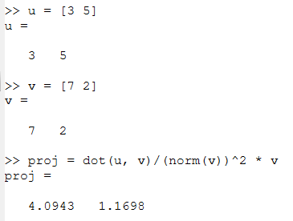

---
## Front matter
lang: ru-RU
title: Лабораторная работа №3
subtitle: Информационная безопасность
author:
  - Николаев Д. И.
institute:
  - Российский университет дружбы народов, Москва, Россия
date: 23 сентября 2023

## i18n babel
babel-lang: russian
babel-otherlangs: english

## Formatting pdf
toc: false
toc-title: Содержание
slide_level: 2
aspectratio: 169
section-titles: true
theme: metropolis
header-includes:
 - \metroset{progressbar=frametitle,sectionpage=progressbar,numbering=fraction}
 - '\makeatletter'
 - '\beamer@ignorenonframefalse'
 - '\makeatother'
---

# Прагматика выполнения

- Закрепление знаний о теоретических основах дискреционного разграничения доступа;
- Получение практических навыков работы с атрибутами файлов для групп пользователей;
- Применение полученных знаний на практике в дальнейшем.

# Цели

Получение практических навыков работы в консоли с атрибутами файлов для групп пользователей.

# Задачи

1. Закрепить основы дискреционного разграничения доступа;
2. Рассмотреть основные команды, связанные с правами доступа к директории или файлу для групп пользователей;
3. Заполнить таблицы с необходимыми правами доступа директории для выполнения некоторых действий членом группы;
4. На основе первой таблицы выяснить минимально необходимые права для выполнения действий над файлами и директориями членом группы.

# Выполнение работы

## Новый пользователь guest2

{#fig:001 width=70%}

{#fig:002 width=70%}

## Вход в систему от имени двух пользователей

{#fig:003 width=70%}

{#fig:004 width=70%}

## Уточнение пользователей

{#fig:005 width=70%}

{#fig:006 width=70%}

## ID пользователей 1

{#fig:007 width=70%}

{#fig:008 width=70%}

{#fig:009 width=70%}

## ID пользователей 2

{#fig:010 width=70%}

{#fig:011 width=70%}

## ID пользователей 3

{#fig:012 width=70%}

## Проверка id пользователей

{#fig:013 width=70%}

## Права доступа к директориям

{#fig:014 width=70%}

{#fig:015 width=70%}

## Снятие прав доступа

{#fig:016 width=70%}

## Таблица установленных прав и разрешённых действий членом группы

{#fig:017 width=160%}

## Таблица минимально необходимых прав для выполнения операций членом группы

{#fig:018 width=70%}

# Результаты

По результатам работы, я получил практические навыки работы в консоли с атрибутами файлов для групп пользователей.
