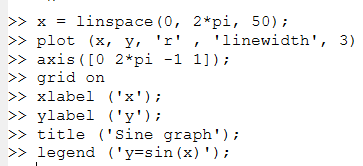
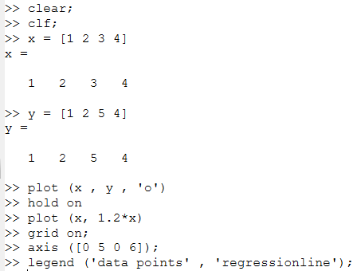
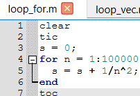
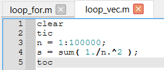
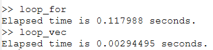

---
## Front matter
title: "Лабораторная работа №3"
subtitle: "Информационная безопасность"
author: "Николаев Дмитрий Иванович"

## Generic otions
lang: ru-RU
toc-title: "Содержание"

## Bibliography
bibliography: bib/cite.bib
csl: pandoc/csl/gost-r-7-0-5-2008-numeric.csl

## Pdf output format
toc: true # Table of contents
toc-depth: 2
lof: true # List of figures
lot: true # List of tables
fontsize: 12pt
linestretch: 1.5
papersize: a4
documentclass: scrreprt
## I18n polyglossia
polyglossia-lang:
  name: russian
  options:
	- spelling=modern
	- babelshorthands=true
polyglossia-otherlangs:
  name: english
## I18n babel
babel-lang: russian
babel-otherlangs: english
## Fonts
mainfont: PT Serif
romanfont: PT Serif
sansfont: PT Sans
monofont: PT Mono
mainfontoptions: Ligatures=TeX
romanfontoptions: Ligatures=TeX
sansfontoptions: Ligatures=TeX,Scale=MatchLowercase
monofontoptions: Scale=MatchLowercase,Scale=0.9
## Biblatex
biblatex: true
biblio-style: "gost-numeric"
biblatexoptions:
  - parentracker=true
  - backend=biber
  - hyperref=auto
  - language=auto
  - autolang=other*
  - citestyle=gost-numeric
## Pandoc-crossref LaTeX customization
figureTitle: "Рис."
tableTitle: "Таблица"
listingTitle: "Листинг"
lofTitle: "Список иллюстраций"
lotTitle: "Список таблиц"
lolTitle: "Листинги"
## Misc options
indent: true
header-includes:
  - \usepackage{indentfirst}
  - \usepackage{float} # keep figures where there are in the text
  - \floatplacement{figure}{H} # keep figures where there are in the text
---

# Цель работы

Получение практических навыков работы в консоли с атрибутами файлов для групп пользователей.

# Выполнение лабораторной работы

1. Во второй лабораторной работе уже была создана учётная запись пользователя guest (useradd guest) и задан пароль для него (passwd guest). Действуя согласно [-@lab3], создадим второго пользователя guest2 ([-@fig:001]).

    {#fig:001 width=70%}

2. Добавим пользователя guest2 в группу guest командой gpasswd -a guest2 guest ([-@fig:002]).

    {#fig:002 width=70%}

3. Войдём в систему от двух пользователей на двух разных консолях: guest на первой консоли ([-@fig:003]) и guest2 на второй консоли ([-@fig:004]).

    {#fig:003 width=70%}

    {#fig:004 width=70%}

4. Для guest ([-@fig:005]) и guest2 ([-@fig:006]) командой pwd определим директорию, в которой находимся.

    {#fig:005 width=70%}

    {#fig:006 width=70%}

5. Уточним для первого ([-@fig:007]) и второго ([-@fig:008]) пользователя имя, его группу, кто входит в неё и к каким группам принадлежит он сам. Определим также к каким группам принадлежат пользователи guest ([-@fig:009]) и guest2 ([-@fig:010]) командами groups guest и groups guest2. Теперь сравним вывод команды groups с выводом команд id -Gn и id -G для первого ([-@fig:011]) и второго пользователей ([-@fig:012]). Нетрудно заметить, что команда id -G выводит код группы пользователей, тогда как остальные только название.

    {#fig:007 width=70%}

    {#fig:008 width=70%}

    {#fig:009 width=70%}

    {#fig:010 width=70%}

    {#fig:011 width=70%}

    {#fig:012 width=70%}

6. Сравним полученную информацию с содержимым файла /etc/group, просмотрев файл командой cat /etc/group ([-@fig:013]). Как видим, полученная информация совпадает с выводом из предыдущего пункта.

    {#fig:013 width=70%}

7. Выполним регистрацию пользователя guest2 в группе guest от имени пользователя guest2 командой newgrp guest ([-@fig:014]).

    {#fig:014 width=70%}

8. Изменим права директории /home/guest, разрешив все действия для пользователей группы от имени пользователя guest, воспользовавшись командой chmod g+rwx /home/guest ([-@fig:015]).

    {#fig:015 width=70%}

9. Снимем с директории /home/guest/dir1 все атрибуты командой chmod 000 dir1 и проверим правильность снятия атрибутов от имени пользователя guest ([-@fig:016]).

    {#fig:016 width=70%}

10. Меняя атрибуты у директории dir1 и файла file1 от имени пользователя guest и делая проверку от пользователя guest2, заполним таблицу, определив опытным путём, какие операции разрешены, а какие нет. Если операция разрешена, будем заносить в таблицу знак «+», если не разрешена --- знак «-» ([-@fig:017]).

    {#fig:017 width=100%}

    Сравнив полученную таблицу с таблицей из предыдущей лабораторной работы, можно сделать вывод, что таблицы не совпадают, так как у членов группы нет прав изменять атрибуты файла. Также обратим внимание, что атрибуты файла, не созданного пользователем guest2, невозможно изменить при любых правах (для созданного --- требуются права на исполнение у директории).

11. На основании заполненной таблицы ([-@fig:017]) определим минимально необходимые права для выполнения пользователем guest2 операций внутри директории dir1 и заполним таблицу ([-@fig:018]).

    {#fig:018 width=70%}

# Выводы

В ходе выполнения лабораторной работы я получил практические навыки работы в консоли с атрибутами файлов для групп пользователей.

# Список литературы{.unnumbered}

::: {#refs}
:::
