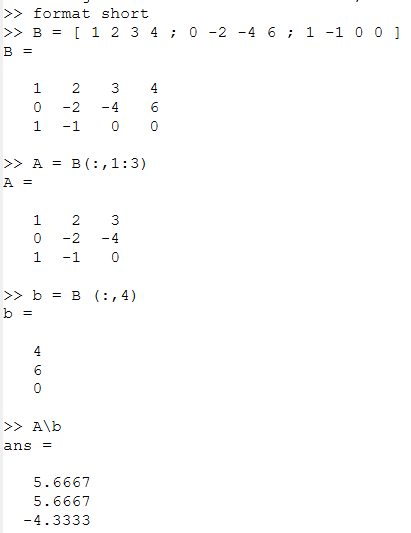
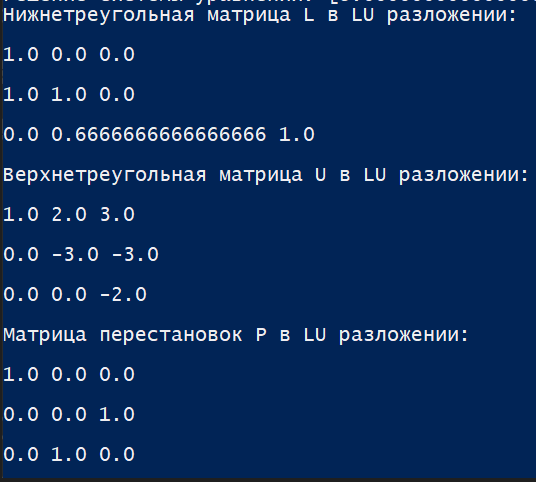

---
## Front matter
lang: ru-RU
title: Лабораторная работа №4
subtitle: Информационная безопасность
author:
  - Николаев Д. И.
institute:
  - Российский университет дружбы народов, Москва, Россия
date: 24 сентября 2023

## i18n babel
babel-lang: russian
babel-otherlangs: english

## Formatting pdf
toc: false
toc-title: Содержание
slide_level: 2
aspectratio: 169
section-titles: true
theme: metropolis
header-includes:
 - \metroset{progressbar=frametitle,sectionpage=progressbar,numbering=fraction}
 - '\makeatletter'
 - '\beamer@ignorenonframefalse'
 - '\makeatother'
---

# Прагматика выполнения

- Повышение навыков использования интерфейса командой строки (CLI);
- Знакомство с расширенными атрибутами при разграничении доступа;
- Применение полученных знаний на практике в дальнейшем.

# Цели

Получение практических навыков работы в консоли с расширенными атрибутами файлов.

# Задачи

1. Закрепить основы дискреционного разграничения доступа;
2. Рассмотреть основные команды, связанные с расширенными правами доступа к файлу;
3. Опробовать дествие расширенных атрибутов "a" и "i" на практике.

# Выполнение работы

## Просмотр расширенных атрибутов файла

{#fig:001 width=70%}

## Установка прав доступа на файл

{#fig:002 width=70%}

## Установка расширенных прав доступа к файлу

{#fig:003 width=70%}

{#fig:004 width=70%}

{#fig:005 width=70%}

## Запись в файл и его чтение

{#fig:006 width=70%}

## Попытка перезаписи в и переименования файла

{#fig:007 width=70%}

{#fig:008 width=70%}

## Снятие расширенного атрибута "a" и проверка команд

{#fig:009 width=70%}

## Установка расширенного атрибута "i" и проверка команд

{#fig:010 width=70%}

# Результаты

По результатам работы, я получил практические навыки работы в консоли с расширенными атрибутами файлов.
