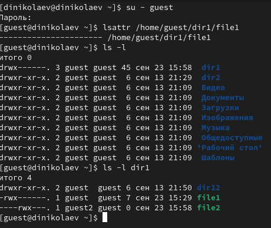
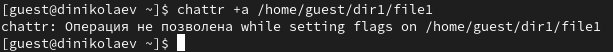
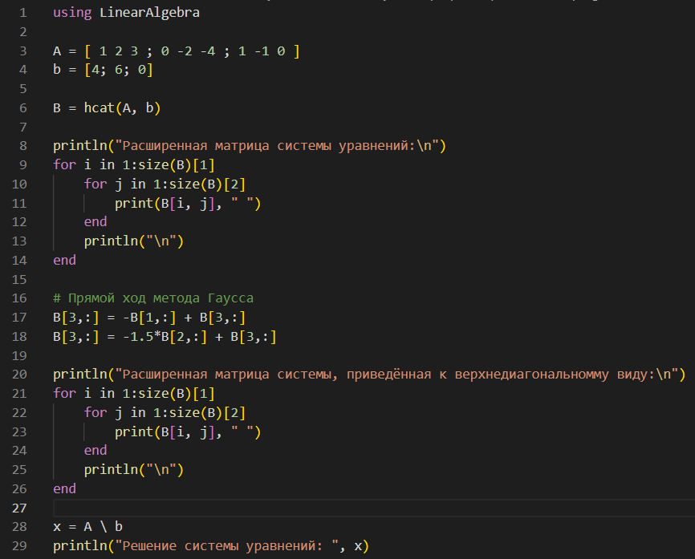
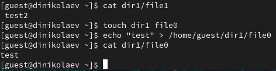
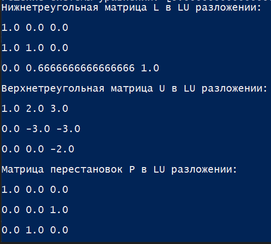
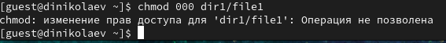
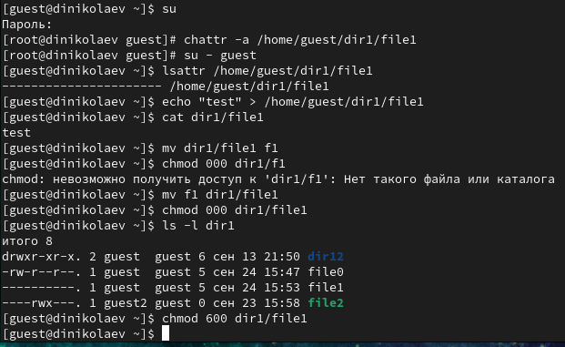
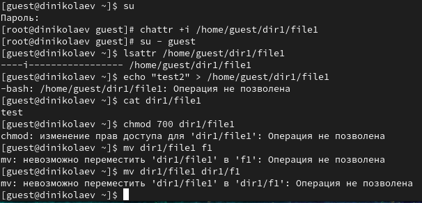

---
## Front matter
title: "Лабораторная работа №4"
subtitle: "Информационная безопасность"
author: "Николаев Дмитрий Иванович"

## Generic otions
lang: ru-RU
toc-title: "Содержание"

## Bibliography
bibliography: bib/cite.bib
csl: pandoc/csl/gost-r-7-0-5-2008-numeric.csl

## Pdf output format
toc: true # Table of contents
toc-depth: 2
lof: true # List of figures
lot: true # List of tables
fontsize: 12pt
linestretch: 1.5
papersize: a4
documentclass: scrreprt
## I18n polyglossia
polyglossia-lang:
  name: russian
  options:
	- spelling=modern
	- babelshorthands=true
polyglossia-otherlangs:
  name: english
## I18n babel
babel-lang: russian
babel-otherlangs: english
## Fonts
mainfont: PT Serif
romanfont: PT Serif
sansfont: PT Sans
monofont: PT Mono
mainfontoptions: Ligatures=TeX
romanfontoptions: Ligatures=TeX
sansfontoptions: Ligatures=TeX,Scale=MatchLowercase
monofontoptions: Scale=MatchLowercase,Scale=0.9
## Biblatex
biblatex: true
biblio-style: "gost-numeric"
biblatexoptions:
  - parentracker=true
  - backend=biber
  - hyperref=auto
  - language=auto
  - autolang=other*
  - citestyle=gost-numeric
## Pandoc-crossref LaTeX customization
figureTitle: "Рис."
tableTitle: "Таблица"
listingTitle: "Листинг"
lofTitle: "Список иллюстраций"
lotTitle: "Список таблиц"
lolTitle: "Листинги"
## Misc options
indent: true
header-includes:
  - \usepackage{indentfirst}
  - \usepackage{float} # keep figures where there are in the text
  - \floatplacement{figure}{H} # keep figures where there are in the text
---

# Цель работы

Получение практических навыков работы в консоли с расширенными атрибутами файлов.

# Выполнение лабораторной работы

1. Действуя согласно [-@lab4], определим расширенные атрибуты файла /home/guest/dir1/file1 от имени пользователя guest командой lsattr /home/guest/dir1/file1 ([-@fig:001]).

    {#fig:001 width=70%}

2. Установим на файл file1 права, разрешающие чтение и запись для владельца файла командой chmod 600 dir1/file1 ([-@fig:002]).

    {#fig:002 width=70%}

3. Попытаемся установить на файл /home/guest/dir1/file1 расширенный атрибут a от имени пользователя guest: chattr +a dir1/file1. В ответ получим отказ от выполнения операции ([-@fig:003]).

    {#fig:003 width=70%}

4. Повысим свои права до администраторских с помощью команды su, и снова попытаемся установить расширенный атрибут a на файл /home/guest/dir1/file1 от имени суперпользователя: chattr +a /home/guest/dir1/file1. В ответ отказа получено не было ([-@fig:004]).

    {#fig:004 width=70%}

5. Проверим правильность установления атрибута от имени пользователя guest: lsattr dir1/file1 ([-@fig:005]).

    {#fig:005 width=70%}

6. Дозапишем в файл file1 слова «test» командой echo "test" dir1/file1 и выполним чтение файла file1 командой cat dir1/file1 (Так как в file1 уже записана информация, то проделаем данные действия с file0, далее нам будет важно только факт имеющейся записи в файле). Убедимся в успешности записи ([-@fig:006]).

    {#fig:006 width=70%}

7. Попробуем удалить файл file1 либо стереть имеющуюся в нём информацию командой echo "abcd" > dirl/file1, но получим отказ. Попробуем также переименовать файл с помощью команды mv dir1/file1 dir1/file11, но результат остается неизменным ([-@fig:007]).

    {#fig:007 width=70%}

8. Попробуем установить на файл file1 права, например, запрещающие чтение и запись для владельца файла с помощью команды chmod 000 file1. Снова получим отказ от выполнения операции ([-@fig:008]).

    {#fig:008 width=70%}

9. Снимем расширенный атрибут a с файла /home/guest/dirl/file1 от имени администратора командой chattr -a /home/guest/dir1/file1 и повторим операции, которые ранее были невыполнимы, в результате все операции успешно выполнены ([-@fig:009]).

    {#fig:009 width=70%}

10. Повторим те же самые действия, заменив атрибут «a» атрибутом «i». Все операции от имени пользователя guest снова не удалось выполнить ([-@fig:010]).

    {#fig:010 width=70%}

# Выводы

В ходе выполнения лабораторной работы я получил практические навыки работы в консоли с расширенными атрибутами файлов.

# Список литературы{.unnumbered}

::: {#refs}
:::
