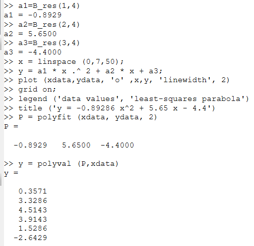
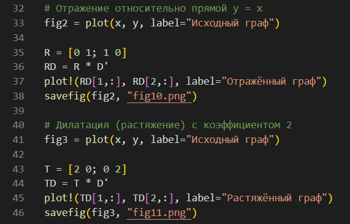

---
## Front matter
title: "Лабораторная работа №5"
subtitle: "Информационная безопасность"
author: "Николаев Дмитрий Иванович"

## Generic otions
lang: ru-RU
toc-title: "Содержание"

## Bibliography
bibliography: bib/cite.bib
csl: pandoc/csl/gost-r-7-0-5-2008-numeric.csl

## Pdf output format
toc: true # Table of contents
toc-depth: 2
lof: true # List of figures
lot: true # List of tables
fontsize: 12pt
linestretch: 1.5
papersize: a4
documentclass: scrreprt
## I18n polyglossia
polyglossia-lang:
  name: russian
  options:
	- spelling=modern
	- babelshorthands=true
polyglossia-otherlangs:
  name: english
## I18n babel
babel-lang: russian
babel-otherlangs: english
## Fonts
mainfont: PT Serif
romanfont: PT Serif
sansfont: PT Sans
monofont: PT Mono
mainfontoptions: Ligatures=TeX
romanfontoptions: Ligatures=TeX
sansfontoptions: Ligatures=TeX,Scale=MatchLowercase
monofontoptions: Scale=MatchLowercase,Scale=0.9
## Biblatex
biblatex: true
biblio-style: "gost-numeric"
biblatexoptions:
  - parentracker=true
  - backend=biber
  - hyperref=auto
  - language=auto
  - autolang=other*
  - citestyle=gost-numeric
## Pandoc-crossref LaTeX customization
figureTitle: "Рис."
tableTitle: "Таблица"
listingTitle: "Листинг"
lofTitle: "Список иллюстраций"
lotTitle: "Список таблиц"
lolTitle: "Листинги"
## Misc options
indent: true
header-includes:
  - \usepackage{indentfirst}
  - \usepackage{float} # keep figures where there are in the text
  - \floatplacement{figure}{H} # keep figures where there are in the text
---

# Цель работы

Изучение механизмов изменения идентификаторов, применения SetUID- и Sticky-битов. Получение практических навыков работы в консоли с дополнительными атрибутами. Рассмотрение работы механизма смены идентификатора процессов пользователей, а также влияние бита Sticky на запись и удаление файлов.

# Теоретическое введение

## SetUID

SetUID (сокращения от англ. set user ID upon execution — "установка ID пользователя во время выполнения") разрешает пользователям запускать исполняемые файлы с правами владельца исполняемого файла. Иногда файлы требуют разрешения на выполнение для пользователей, которые не являются членами группы владельца, в этом случае потребуется предоставить специальные разрешения на выполнение. Когда SetUID установлен, пользователь может запускать любую программу, как её владелец.

## Sticky-бит

В случае, если этот бит установлен для папки, то файлы в этой папке могут быть удалены только их владельцем. Пример использования этого бита в операционной системе это системная папка /tmp . Эта папка разрешена на запись любому пользователю, но удалять файлы в ней могут только пользователи, являющиеся владельцами этих файлов. Символ «t» указывает, что на папку установлен Sticky-бит.

# Выполнение лабораторной работы

С помощью команды gcc -v убедимся, что у меня установлен компилятор gcc ([-@fig:001]).

{#fig:001 width=70%}

## Создание программы

1. Действуя согласно [-@lab5], зайдём от имени пользователя guest и создадим файл simpleid.c ([-@fig:002]--[-@fig:003]).

    {#fig:002 width=70%}

    {#fig:003 width=70%}

2. Скомпилируем программу и убедимся, что исполняемый файл программы создан: gcc simpleid.c -o simpleid. Выполним программу simpleid: ./simpleid и сравним с выводом системной программы id. Как можно заметить, выводы идентичны ([-@fig:004]).

    {#fig:004 width=70%}

3. Усложним программу, добавив вывод действительных идентификаторов. Получившуюся программу назовём simpleid2.c ([-@fig:005]). После скомпилируем и запустим получившийся исполняемый файл ([-@fig:006]).

    {#fig:005 width=70%}

    {#fig:006 width=70%}

4. От имени суперпользователя выполним команды ([-@fig:007]):

    - chown root:guest /home/guest/simpleid2
    - chmod u+s /home/guest/simpleid2

    {#fig:007 width=70%}

    Команда chown root:guest /home/guest/simpleid2 меняет владельца файла (с guest на root). Команда chmod u+s /home/guest/simpleid2 меняет права доступа к файлу (добавляет атрибут s (вместо x у владельца файла)).

5. Выполним проверку правильности установки новых атрибутов и смены владельца файла simpleid2: ls -l simpleid2 и запустим simpleid2 и id. Для пользователя root все выводы равняются 0 ([-@fig:008]).

    {#fig:008 width=70%}

6. Проверим вывод для пользователя guest ([-@fig:009]).

    {#fig:009 width=70%}

7. Проделаем тоже самое относительно SetGID-бита, предварительно сняв UID-бит ([-@fig:010]).

    {#fig:010 width=70%}

8. Создадим программу readfile.c ([-@fig:011]) и скомпилируем её: gcc readfile.c -o readfile. Сменим владельца у файла readfile.c и изменим права так, чтобы только суперпользователь (root) мог прочитать его, a guest не мог, совершив проверку выполненного ([-@fig:012]).

    {#fig:011 width=70%}

    {#fig:012 width=70%}

9. Сменим у программы readfile владельца и установим SetUID-бит ([-@fig:013]).

    {#fig:013 width=70%}

10. Проверим, может ли программа readfile прочитать файл readfile.c ([-@fig:014]) и /etc/shadow ([-@fig:015]). Так как мы установили SetUID-бит программе readfile, то ей временно предоставляются права владельца файла. 

    {#fig:014 width=70%}

    {#fig:015 width=70%}

## Исследование Sitcky-бита

1. Выясним, установлен ли атрибут Sticky на директории /tmp, для чего выполним команду ls -l / | grep tmp. От имени пользователя guest создадим файл file01.txt в директории /tmp со словом test: echo "test" > /tmp/file01.txt. Просмотрим атрибуты у только что созданного файла и разрешим чтение и запись для категории пользователей «все остальные» ([-@fig:016]):

    - ls -l /tmp/file01.txt
    - chmod o+rw /tmp/file01.txt
    - ls -l /tmp/file01.txt

    {#fig:016 width=70%}

    Установим права на запись и чтение для всех категорий пользователей ([-@fig:017]).

    {#fig:017 width=70%}

2. От имени пользователя guest2 (не являющегося владельцем) попробуем прочитать файл /tmp/file01.txt: cat /tmp/file01.txt, дозаписать текст в него командой echo "test2" >> /tmp/file01.txt, перезаписать файл командой echo "test3" > /tmp/file01.txt и попробуем удалить файл. Все действия кроме удаления выполнить удалось ([-@fig:018]).

    {#fig:018 width=70%}

3. Снимем атрибут t (Sticky-бит) с файла file01.txt от имени суперпользователя и повторим действия из предыдущего шага ([-@fig:019]). Помимо уже успешно выполнимых действий с файлом, мы теперь смогли удалить файл от имени пользователя, не являющегося его владельцем. Таким образом, Sticky-bit позволяет защищать файлы от случайного удаления, когда несколько пользователей имеют права на запись в один и тот же файл. Если у файла атрибут t стоит, значит пользователь может удалить файл, только если он является пользователем-владельцем файла или каталога, в котором содержится файл. Если же этот атрибут не установлен, то удалить файл могут все пользователи, которым позволено удалять файлы из каталога.

    {#fig:019 width=70%}

4. Повысим свои права до суперпользователя и вернём атрибут t на директорию /tmp ([-@fig:020]) и проверим возвращение атрибута ([-@fig:021]).

    {#fig:020 width=70%}

    {#fig:021 width=70%}

# Выводы

В ходе выполнения лабораторной работы я изучил механизмы изменения идентификаторов, применения SetUID и Sticky-битов. Я получила практические навыки работы в консоли с дополнительными атрибутами. Я рассмотрела работу механизма смены идентификатора процессов пользователей, а также влияние бита Sticky на запись и удаление файлов.

# Список литературы{.unnumbered}

::: {#refs}
:::
