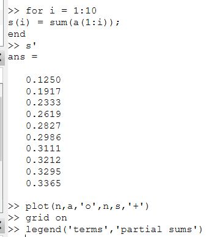
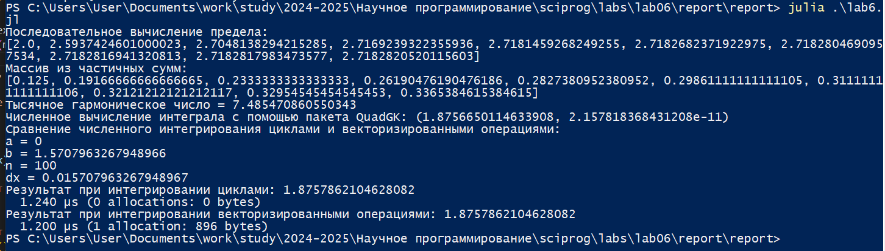

---
## Front matter
title: "Лабораторная работа №6"
subtitle: "Информационная безопасность"
author: "Николаев Дмитрий Иванович"

## Generic otions
lang: ru-RU
toc-title: "Содержание"

## Bibliography
bibliography: bib/cite.bib
csl: pandoc/csl/gost-r-7-0-5-2008-numeric.csl

## Pdf output format
toc: true # Table of contents
toc-depth: 2
lof: true # List of figures
lot: true # List of tables
fontsize: 12pt
linestretch: 1.5
papersize: a4
documentclass: scrreprt
## I18n polyglossia
polyglossia-lang:
  name: russian
  options:
	- spelling=modern
	- babelshorthands=true
polyglossia-otherlangs:
  name: english
## I18n babel
babel-lang: russian
babel-otherlangs: english
## Fonts
mainfont: PT Serif
romanfont: PT Serif
sansfont: PT Sans
monofont: PT Mono
mainfontoptions: Ligatures=TeX
romanfontoptions: Ligatures=TeX
sansfontoptions: Ligatures=TeX,Scale=MatchLowercase
monofontoptions: Scale=MatchLowercase,Scale=0.9
## Biblatex
biblatex: true
biblio-style: "gost-numeric"
biblatexoptions:
  - parentracker=true
  - backend=biber
  - hyperref=auto
  - language=auto
  - autolang=other*
  - citestyle=gost-numeric
## Pandoc-crossref LaTeX customization
figureTitle: "Рис."
tableTitle: "Таблица"
listingTitle: "Листинг"
lofTitle: "Список иллюстраций"
lotTitle: "Список таблиц"
lolTitle: "Листинги"
## Misc options
indent: true
header-includes:
  - \usepackage{indentfirst}
  - \usepackage{float} # keep figures where there are in the text
  - \floatplacement{figure}{H} # keep figures where there are in the text
---

# Цель работы

Развить навыки администрирования ОС Linux. Получить первое практическое знакомство с технологией SELinux.

Проверить работу SELinux на практике совместно с веб-сервером Apache.

# Теоретическое введение

**Домен** --- список действий, которые может выполнять процесс. Обычно в качестве домена определяется минимально возможный набор действий, при помощи которых процесс способен функционировать. Таким образом, если процесс дискредитирован, злоумышленнику не удастся нанести большого вреда.

**Роль** --- список доменов, которые могут быть применены. Если какого-то домена нет в списке доменов какой-то роли, то действия из этого домена не могут быть применены.

**Тип** --- набор действий, которые допустимы по отношения к объекту. Тип отличается от домена тем, что он может применяться к пайпам, каталогам и файлам, в то время как домен применяется к процессам.

*Контекст безопасности* --- все атрибуты SELinux --- роли, типы и домены [-@theory].

# Выполнение лабораторной работы

Установим веб-сервер Apache с помощью команды yum install httpd, после чего следуем согласно [-@lab6].

1. Войдем в систему и убедимся, что SELinux работает в режиме enforcing политики targeted с помощью команд getenforce и sestatus. ([-@fig:001]).

    {#fig:001 width=70%}

2. Обратимся с помощью браузера к веб-серверу, запущенному на нашем компьютере, и убедимся, что последний работает: service httpd status ([-@fig:002]).

    {#fig:002 width=70%}

3. Найдем веб-сервер Apache в списке процессов, определим его контекст безопасности командами ps auxZ | grep httpd и ps -eZ | grep httpd. Имеем следующий контекст: system_u:system_r:httpd_t (пользователь:роль:тип) ([-@fig:003]).

    {#fig:003 width=70%}

4. Посмотрим текущее состояние переключателей SELinux для Apache с помощью команды sestatus -b | grep httpd ([-@fig:004]):

    {#fig:004 width=70%}

5. Посмотрим статистику по политике с помощью команды seinfo. Как видим, имеется 8 пользователей, 15 ролей и 5135 типов ([-@fig:005]).

    {#fig:005 width=70%}

6. Определим тип файлов и поддиректорий, находящихся в директории /var/www с помощью команды ls -lZ /var/www --- в ней находится две поддиректории. Определим тип файлов, находящихся в директории /var/www/html командой ls -lZ /var/www/html --- директория пуста. Определим круг пользователей, которым разрешено создание файлов в
директории /var/www/html --- разрешено только владельцу директории ([-@fig:006]).

    {#fig:006 width=70%}

7. Создадим от имени суперпользователя (так как в дистрибутиве после установки только ему разрешена запись в директорию) html-файл /var/www/html/test.html следующего содержания ([-@fig:007]):

    ```html
    <html>
    <body>test</body>
    </html>
    ```

    {#fig:007 width=70%}

8. Проверим контекст созданного нами файла. По умолчанию устанавливается следующий контекст: пользователь --- unconfined_u (несвязанный), роль --- object_r, тип --- httpd_sys_content_t ([-@fig:008]).

    {#fig:008 width=70%}

9. Обратимся к файлу через веб-сервер, введя в браузере адрес http://127.0.0.1/test.html. Убедимся, что файл был успешно отображён ([-@fig:009]).

    {#fig:009 width=70%}

10. Изучим справку man httpd_selinux. Справки по httpd_selinux нет, а справки по httpd и selinux не содержат информации о возможных контекстах. Проверим контекст нашего файла командой ls -Z /var/www/html/test.html ([-@fig:010]).

    {#fig:010 width=70%}

11. Изменим контекст файла /var/www/html/test.html с httpd_sys_content_t на любой другой, к которому процесс httpd не должен иметь доступа, например, на samba_share_t ([-@fig:011]):

    - chcon -t samba_share_t /var/www/html/test.html
    - ls -Z /var/www/html/test.html

    {#fig:011 width=70%}

12. Попробуем ещё раз получить доступ к файлу через веб-сервер, введя в браузере адрес http://127.0.0.1/test.html. Получили сообщение об ошибке ([-@fig:012]):

    Forbidden
    You don't have permission to access /test.html on this server

    {#fig:012 width=70%}

13. Проанализируем ситуацию командой ls -l /var/www/html/test.html. Просмотрим log-файлы веб-сервера Apache. Также просмотрим системный лог-файл: tail /var/log/messages ([-@fig:013]).

    {#fig:013 width=70%}

    Не смогли получить доступ к кэшу и сообщение о деактивации от setroubleshootd.service.

14. Попробуем запустить веб-сервер Apache на прослушивание ТСР-порта 81 (а не 80, как рекомендует IANA и прописано в /etc/services). Для этого в файле /etc/httpd/conf/httpd.conf найдем строчку Listen 80 и заменим её на Listen 81 ([-@fig:014]).

    {#fig:014 width=70%}

15. Выполним перезапуск веб-сервера Apache ([-@fig:015]).

    {#fig:015 width=70%}

    Снова попытавшись получить доступ через веб-сервер, введя адрес в браузере увидим следующую картину ([-@fig:016]).

    {#fig:016 width=70%}

16. Проанализируем лог-файлы: tail -n10 /var/log/messages. Также просмотрим файлы /var/log/httpd/error_log, /var/log/httpd/access_log и /var/log/audit/audit.log/ Новые записи появились в файлах /var/log/messages и /var/log/httpd/error_log. ([-@fig:017]).

    {#fig:017 width=70%}

17. Выполним команду semanage port -a -t http_port_t -р tcp 81. После проверим список портов командой semanage port -l | grep http_port_t. Убедимся, что порт 81 появился в списке ([-@fig:018]).

    {#fig:018 width=70%}

18. Попробуем запустить веб-сервер Apache ещё раз ([-@fig:019]).

    {#fig:019 width=70%}

19. Вернем контекст httpd_sys_cоntent__t к файлу /var/www/html/test.html: chcon -t httpd_sys_content_t /var/www/html/test.html ([-@fig:020]). После этого попробуем получить доступ к файлу через веб-сервер, введя в браузере адрес http://127.0.0.1:81/test.html. Увидим содержимое файла --- слово «test» ([-@fig:021]).

    {#fig:020 width=70%}

    {#fig:021 width=70%}

20. Исправим обратно конфигурационный файл apache, вернув Listen 80 ([-@fig:022]).

    {#fig:022 width=70%}

21. Удалим привязку http_port_t к 81 порту: semanage port -d -t http_port_t -p tcp 81. Порт 81 не был удален, так как в начале 80 и 81 порты были настроены по умолчанию ([-@fig:023]).

    {#fig:023 width=70%}

22. Удалим файл /var/www/html/test.html: rm /var/www/html/test.html ([-@fig:024]).

    {#fig:024 width=70%}

# Выводы

В ходе выполнения лабораторной работы я развил навыки администрирования ОС Linux, получил первое практическое знакомство с технологией SELinux и проверил работу SELinux на практике совместно с веб-сервером Apache.

# Список литературы{.unnumbered}

::: {#refs}
:::
