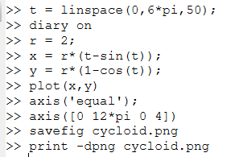

---
## Front matter
lang: ru-RU
title: Лабораторная работа №7
subtitle: Информационная безопасность
author:
  - Николаев Д. И.
institute:
  - Российский университет дружбы народов, Москва, Россия
date: 13 октября 2023

## i18n babel
babel-lang: russian
babel-otherlangs: english

## Formatting pdf
toc: false
toc-title: Содержание
slide_level: 2
aspectratio: 169
section-titles: true
theme: metropolis
header-includes:
 - \metroset{progressbar=frametitle,sectionpage=progressbar,numbering=fraction}
 - '\makeatletter'
 - '\beamer@ignorenonframefalse'
 - '\makeatother'
---

# Цели

Освоить на практике применение режима однократного гаммирования.

# Задачи

1. Реализовать режим однократного гаммирования;
2. Найти зашифрованный текст по известному исходному тексту и ключу;
3. Найти ключ по известному зашифрованному и исходному тексту.

# Выполнение работы

## Создание словаря

```Julia
const S = """абвгдеёжзийклмнопрстуфхцчшщъыьэюяАБВГДЕЁЖЗИЙКЛМНОПР
СТУФХЦЧШЩЪЫЬЭЮЯ0123456789., !-"""
const N = length(S)

Dictionary = Dict(zip(S, 1:length(S)))
# Сделаем словарь с ключом и значением наоборот
Dictionary2 = Dict(zip(values(Dictionary), keys(Dictionary)))
```

## Получение шифротекста по известному исходному тексту и ключу 1

```Julia
function Gamma_Find_Encrypted_Text(Source_Message::String, Key::String)::String
    n = length(Source_Message)  # Длина исходного сообщения
    println("Исходное сообщение - ", Source_Message)
    println("Ключ - ", Key)
    n != length(Key) ? println("Размерности ключа и сообщения не равны") : skip
    Source_Code = []
    Key_Code = []
    for i in Source_Message
        push!(Source_Code, Dictionary[i])
    end
    for i in Key
        push!(Key_Code, Dictionary[i])
    end
    println("Код исходного сообщения - ", Source_Code)
```

## Получение шифротекста по известному исходному тексту и ключу 2

```Julia
    println("Код ключа - ", Key_Code)
    Encrypted_Code = []   # Код зашифрованного сообщения
    for i in range(1, n)
        a = Source_Code[i] + Key_Code[i]
        a > N ? a %= N : skip
        push!(Encrypted_Code, a)
    end
    println("Код зашифрованного сообщения - ", Encrypted_Code)
    Encrypted_Message = ""
    for i in Encrypted_Code
        Encrypted_Message *= Dictionary2[i]
    end
    println("Зашифрованное сообщение - ", Encrypted_Message)
```

## Получение шифротекста по известному исходному тексту и ключу 3

```Julia
    Decrypted_Code = []   # Код зашифрованного сообщения
    for i in range(1, n)
        a = Encrypted_Code[i] - Key_Code[i]
        a <= 0 ? a += N : skip
        push!(Decrypted_Code, a)
    end
    println("Код дешифрованного сообщения - ", Decrypted_Code)
    Decrypted_Message = ""
    for i in Decrypted_Code
        Decrypted_Message *= Dictionary2[i]
    end
    println("Дешифрованное сообщение - ", Decrypted_Message)
    return Encrypted_Message
```

## Получение ключа по известному исходному тексту и шифротексту 1

```Julia
function Gamma_Find_Key_Text(Source_Message::String, Encrypted_Message::String)::String
    n = length(Source_Message)  # Длина исходного сообщения
    println("Исходное сообщение - ", Source_Message)
    println("Зашифрованное сообщение - ", Encrypted_Message)
    n != length(Encrypted_Message) ? println("Несоответсвие размерности исходного и зашифрованного сообщений") : skip
    Source_Code = []
    Encrypted_Code = []
    for i in Source_Message
        push!(Source_Code, Dictionary[i])
    end
    for i in Encrypted_Message
        push!(Encrypted_Code, Dictionary[i])
    end
    println("Код исходного сообщения - ", Source_Code)
```

## Получение ключа по известному исходному тексту и шифротексту 2

```Julia
    println("Код зашифрованного сообщения - ", Encrypted_Code)
    Key_Code = []   # Код ключа
    for i in range(1, n)
        a = Encrypted_Code[i] - Source_Code[i]
        a <= 0 ? a += N : skip
        push!(Key_Code, a)
    end
    println("Код ключа - ", Key_Code)
    Key = ""
    for i in Key_Code
        Key *= Dictionary2[i]
    end
    println("Ключ - ", Key)
    return Key
end
```

## Вызов функций

```Julia
Source_Text = "С Новым Годом, друзья!"
Given_Key = "АБВГДЕжзийклмнопрстуфх"

Result_Encrypted_Message = Gamma_Find_Encrypted_Text(Source_Text, Given_Key) 
println("Зашифрованное сообщение, имея исходный текст и ключ - ", Result_Encrypted_Message)

Result_Key = Gamma_Find_Key_Text(Source_Text, Result_Encrypted_Message)
println("Ключ, имея исходный текст и зашифрованное сообщение - ", Result_Key)

if Given_Key == Result_Key
    println("Однократное гаммирование работает - успех!")
else
    println("Неудача")
end
```

## Результат

{#fig:001 width=70%}

# Результаты

По результатам работы, я освоил на практике применение режима однократного гаммирования.
