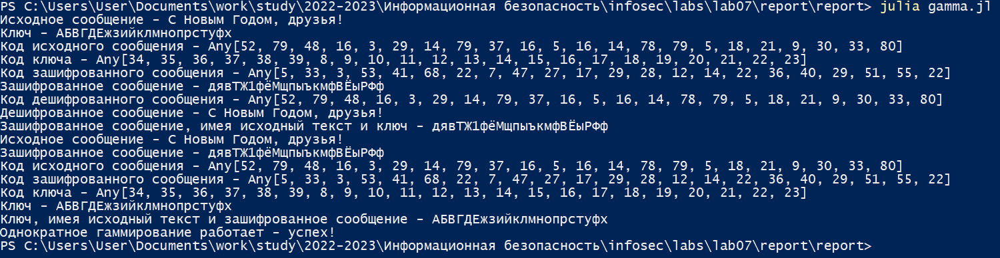

---
## Front matter
title: "Лабораторная работа №7"
subtitle: "Информационная безопасность"
author: "Николаев Дмитрий Иванович"

## Generic otions
lang: ru-RU
toc-title: "Содержание"

## Bibliography
bibliography: bib/cite.bib
csl: pandoc/csl/gost-r-7-0-5-2008-numeric.csl

## Pdf output format
toc: true # Table of contents
toc-depth: 2
lof: true # List of figures
lot: true # List of tables
fontsize: 12pt
linestretch: 1.5
papersize: a4
documentclass: scrreprt
## I18n polyglossia
polyglossia-lang:
  name: russian
  options:
	- spelling=modern
	- babelshorthands=true
polyglossia-otherlangs:
  name: english
## I18n babel
babel-lang: russian
babel-otherlangs: english
## Fonts
mainfont: PT Serif
romanfont: PT Serif
sansfont: PT Sans
monofont: PT Mono
mainfontoptions: Ligatures=TeX
romanfontoptions: Ligatures=TeX
sansfontoptions: Ligatures=TeX,Scale=MatchLowercase
monofontoptions: Scale=MatchLowercase,Scale=0.9
## Biblatex
biblatex: true
biblio-style: "gost-numeric"
biblatexoptions:
  - parentracker=true
  - backend=biber
  - hyperref=auto
  - language=auto
  - autolang=other*
  - citestyle=gost-numeric
## Pandoc-crossref LaTeX customization
figureTitle: "Рис."
tableTitle: "Таблица"
listingTitle: "Листинг"
lofTitle: "Список иллюстраций"
lotTitle: "Список таблиц"
lolTitle: "Листинги"
## Misc options
indent: true
header-includes:
  - \usepackage{indentfirst}
  - \usepackage{float} # keep figures where there are in the text
  - \floatplacement{figure}{H} # keep figures where there are in the text
---

# Цель работы

Освоить на практике применение режима однократного гаммирования.

# Теоретическое введение

*Гаммирование* представляет собой наложение (снятие) на открытые (зашифрованные) данные последовательности элементов других данных, полученной с помощью некоторого криптографического алгоритма, для получения зашифрованных (открытых) данных. Иными словами, наложение гаммы --- это сложение её элементов с элементами открытого (закрытого) текста по некоторому фиксированному модулю, значение которого представляет собой известную часть алгоритма шифрования.

В соответствии с теорией криптоанализа, если в методе шифрования используется однократная вероятностная гамма (однократное гаммирование) той же длины, что и подлежащий сокрытию текст, то текст нельзя раскрыть. Даже при раскрытии части последовательности гаммы нельзя получить информацию о всём скрываемом тексте.

Наложение гаммы по сути представляет собой выполнение операции сложения по модулю 2 (XOR) (обозначаемая знаком $\bigoplus$) между элементами
гаммы и элементами подлежащего сокрытию текста.

Такой метод шифрования является симметричным, так как двойное прибавление одной и той же величины по модулю 2 восстанавливает исходное значение, а шифрование и расшифрование выполняется одной и той же программой.

Если известны ключ и открытый текст, то задача нахождения шифротекста заключается в применении к каждому символу открытого текста следующего правила:

\begin{equation}
\label{eq1}
C_i = P_i \bigoplus K_i,
\end{equation}
где $C_i$ --- i-й символ получившегося зашифрованного послания, $P_i$ --- i-й символ открытого текста, $K_i$ --- i-й символ ключа, $i = \overline{1, m}$. Размерности открытого текста и ключа должны совпадать, и полученный шифротекст будет такой же длины.

Если известны шифротекст и открытый текст, то задача нахождения ключа решается также в соответствии с \ref{eq1}, а именно, обе части равенства необходимо сложить по модулю 2 с $P_i$:

\begin{equation}
\label{eq2}
C_i \bigoplus P_i = P_i \bigoplus K_i \bigoplus P_i = K_i,
K_i = C_i \bigoplus P_i.
\end{equation}

Открытый текст имеет символьный вид, а ключ --- шестнадцатеричное представление. Ключ также можно представить в символьном виде, воспользовавшись таблицей ASCII-кодов.

К. Шеннон доказал абсолютную стойкость шифра в случае, когда однократно используемый ключ, длиной, равной длине исходного сообщения, является фрагментом истинно случайной двоичной последовательности с равномерным законом распределения. Криптоалгоритм не даёт никакой информации об открытом тексте: при известном зашифрованном сообщении $C$ все различные ключевые последовательности $K$ возможны и равновероятны, а значит, возможны и любые сообщения $P$.

Необходимые и достаточные условия абсолютной стойкости шифра:

- полная случайность ключа;
- равенство длин ключа и открытого текста;
- однократное использование ключа.[-@lab7].

# Выполнение лабораторной работы

Подберем ключ, чтобы получить сообщение «С Новым Годом, друзья!». Разработаем приложение, позволяющее шифровать и дешифровать данные в режиме однократного гаммирования. Приложение должно:

1. Определить вид шифротекста при известном ключе и известном открытом тексте.
2. Определить ключ, с помощью которого шифротекст может быть преобразован в некоторый фрагмент текста, представляющий собой один из возможных вариантов прочтения открытого текста.

Реализуем приложение с помощью языка Julia, где первая функция будет выдавать вид шифротекста при известном ключе и известном открытом тексте (также проведем проверку проведя дешифровку сообщения), а вторая --- вид ключа при известном открытом тексте и шифротексте. Результат работы программы представлен на ([-@fig:001]).

Так как в программе реализован собственный словарь (длины 81), то рассматривается не операция исключающего ИЛИ, а остатки от деления на длину словаря. Так в случае получения шифротекста вместо
\begin{equation}
C_i = P_i \bigoplus K_i,
\end{equation}
имеем
\begin{equation}
C_i \equiv P_i + K_i \pmod{N},
\end{equation}
где $N$ --- длина словаря, $K$ --- код ключа, $P$ --- код исходного сообщения, $C$ --- код зашифрованного сообщения; остаток 0 означает последний элемент словаря.

А в случае получения ключа вместо
\begin{equation}
C_i \bigoplus P_i = P_i \bigoplus K_i \bigoplus P_i = K_i,
\end{equation}
имеем
\begin{equation}
K_i \equiv C_i - P_i \pmod{N},
\end{equation}

Ниже представлен код реализации на Julia:

```Julia
const S = """абвгдеёжзийклмнопрстуфхцчшщъыьэюяАБВГДЕЁЖЗИЙКЛМНОПР
СТУФХЦЧШЩЪЫЬЭЮЯ0123456789., !-"""
const N = length(S)

Dictionary = Dict(zip(S, 1:length(S)))
# Сделаем словарь с ключом и значением наоборот
Dictionary2 = Dict(zip(values(Dictionary), keys(Dictionary)))

function Gamma_Find_Encrypted_Text(Source_Message::String, Key::String)::String
    n = length(Source_Message)  # Длина исходного сообщения
    println("Исходное сообщение - ", Source_Message)
    println("Ключ - ", Key)
    n != length(Key) ? println("Размерности ключа и сообщения не равны") : skip
    Source_Code = []
    Key_Code = []
    for i in Source_Message
        push!(Source_Code, Dictionary[i])
    end
    for i in Key
        push!(Key_Code, Dictionary[i])
    end
    println("Код исходного сообщения - ", Source_Code)
    println("Код ключа - ", Key_Code)
    Encrypted_Code = []   # Код зашифрованного сообщения
    for i in range(1, n)
        a = Source_Code[i] + Key_Code[i]
        a > N ? a %= N : skip
        push!(Encrypted_Code, a)
    end
    println("Код зашифрованного сообщения - ", Encrypted_Code)
    Encrypted_Message = ""
    for i in Encrypted_Code
        Encrypted_Message *= Dictionary2[i]
    end
    println("Зашифрованное сообщение - ", Encrypted_Message)

    Decrypted_Code = []   # Код зашифрованного сообщения
    for i in range(1, n)
        a = Encrypted_Code[i] - Key_Code[i]
        a <= 0 ? a += N : skip
        push!(Decrypted_Code, a)
    end
    println("Код дешифрованного сообщения - ", Decrypted_Code)
    Decrypted_Message = ""
    for i in Decrypted_Code
        Decrypted_Message *= Dictionary2[i]
    end
    println("Дешифрованное сообщение - ", Decrypted_Message)
    return Encrypted_Message
end

function Gamma_Find_Key_Text(Source_Message::String, Encrypted_Message::String)::String
    n = length(Source_Message)  # Длина исходного сообщения
    println("Исходное сообщение - ", Source_Message)
    println("Зашифрованное сообщение - ", Encrypted_Message)
    n != length(Encrypted_Message) ? println("Несоответсвие размерности исходного и зашифрованного сообщений") : skip
    Source_Code = []
    Encrypted_Code = []
    for i in Source_Message
        push!(Source_Code, Dictionary[i])
    end
    for i in Encrypted_Message
        push!(Encrypted_Code, Dictionary[i])
    end
    println("Код исходного сообщения - ", Source_Code)
    println("Код зашифрованного сообщения - ", Encrypted_Code)
    Key_Code = []   # Код ключа
    for i in range(1, n)
        a = Encrypted_Code[i] - Source_Code[i]
        a <= 0 ? a += N : skip
        push!(Key_Code, a)
    end
    println("Код ключа - ", Key_Code)
    Key = ""
    for i in Key_Code
        Key *= Dictionary2[i]
    end
    println("Ключ - ", Key)
    return Key
end

Source_Text = "С Новым Годом, друзья!"
Given_Key = "АБВГДЕжзийклмнопрстуфх"

Result_Encrypted_Message = Gamma_Find_Encrypted_Text(Source_Text, Given_Key) 
println("Зашифрованное сообщение, имея исходный текст и ключ - ", Result_Encrypted_Message)

Result_Key = Gamma_Find_Key_Text(Source_Text, Result_Encrypted_Message)
println("Ключ, имея исходный текст и зашифрованное сообщение - ", Result_Key)

if Given_Key == Result_Key
    println("Однократное гаммирование работает - успех!")
else
    println("Неудача")
end
```

{#fig:001 width=70%}

# Ответы на вопросы

1. Поясните смысл однократного гаммирования.

    Гаммирование --- выполнение операции XOR (исключающее ИЛИ) между элементами гаммы и элементами подлежащего сокрытию текста. Если в методе шифрования используется однократная вероятностная гамма (однократное гаммирование) той же длины, что и подлежащий сокрытию текст, то текст нельзя раскрыть, так как даже при раскрытии части последовательности гаммы нельзя получить информацию о всём скрываемом тексте.

2. Перечислите недостатки однократного гаммирования.

    Абсолютная стойкость шифра доказана только для случаев, где:
    - однократно используемый ключ;
    - обладает длиной, равной длине исходного сообщения;
    - является фрагментом истинно случайной двоичной последовательности с равномерным законом распределения.

3. Перечислите преимущества однократного гаммирования.

    - Такой способ симметричен, т.е. двойное прибавление одной и той же величины по модулю 2 восстанавливает исходное значение.
    - Шифрование и расшифрование может быть выполнено одной и той же программой.
    - Криптоалгоритм не даёт никакой информации об открытом тексте: при известном зашифрованном сообщении $C$ все различные ключевые последовательности $K$ возможны и равновероятны, а значит, возможны и любые сообщения $P$.

4. Почему длина открытого текста должна совпадать с длиной ключа?

    Если ключ короче текста, то операция XOR будет применена не ко всем элементам и конец сообщения будет не закодирован. Если ключ будет длиннее, то появится неоднозначность декодирования.

5. Какая операция используется в режиме однократного гаммирования, назовите её особенности?

    Наложение гаммы по сути представляет собой выполнение операции исключающего ИЛИ (XOR), т.е. мы должны сложить каждый элемент гаммы с соответствующим элементом ключа. Данная операция является симметричной, так как прибавление одной и той же величины по модулю 2 восстанавливает исходное значение.

6. Как по открытому тексту и ключу получить шифротекст?

    В таком случае задача сводится к правилу: $C_i = P_i \bigoplus K_i$, т.е. мы поэлементно получаем символы зашифрованного сообщения, применяя операцию исключающего или к соответствующим элементам ключа и открытого текста.

7. Как по открытому тексту и шифротексту получить ключ?

    Подобная задача решается путем применения операции исключающего или к последовательностям символов зашифрованного и открытого сообщений: $K_i = P_i \bigoplus C_i$.

8. В чем заключаются необходимые и достаточные условия абсолютной стойкости шифра?

    Необходимые и достаточные условия абсолютной стойкости шифра:

    - полная случайность ключа;
    - равенство длин ключа и открытого текста;
    - однократное использование ключа.

# Выводы

В ходе выполнения лабораторной работы я освоил на практике применение режима однократного гаммирования.

# Список литературы{.unnumbered}

::: {#refs}
:::
