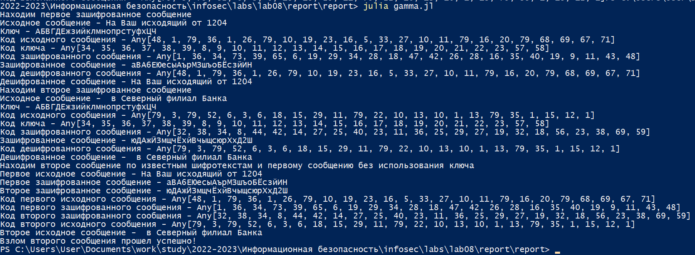

---
## Front matter
lang: ru-RU
title: Лабораторная работа №8
subtitle: Информационная безопасность
author:
  - Николаев Д. И.
institute:
  - Российский университет дружбы народов, Москва, Россия
date: 14 октября 2023

## i18n babel
babel-lang: russian
babel-otherlangs: english

## Formatting pdf
toc: false
toc-title: Содержание
slide_level: 2
aspectratio: 169
section-titles: true
theme: metropolis
header-includes:
 - \metroset{progressbar=frametitle,sectionpage=progressbar,numbering=fraction}
 - '\makeatletter'
 - '\beamer@ignorenonframefalse'
 - '\makeatother'
---

# Цели

Освоить на практике применение режима однократного гаммирования на примере кодирования различных исходных текстов одним ключом.

# Задачи

1. Реализовать режим однократного гаммирования;
2. Найти текст второго сообщения по известным шифротекстам и первому сообщению.

# Выполнение работы

## Вывод формулы

Вместо
\begin{equation}
\label{eq:3}
C_1 \bigoplus C_2 \bigoplus P_1 = P_1 \bigoplus P_2 \bigoplus P_1 = P_2.
\end{equation}
имеем следующие выражения
\begin{equation}
C_1 + C_2 \equiv P_1 + K + P_2 + K \equiv P_1 + P_2 + 2K \pmod{N},
\end{equation}
\begin{equation}
C_i \equiv P_i + K \pmod{N},\quad i = 1, 2
\end{equation}
\begin{equation}
C_1 + C_2 \equiv P_1 + (C_2 - K) + 2K \equiv P_1 + C_2 + K \pmod{N},
\end{equation}
\begin{equation}
P_2 \equiv C_2 - K \equiv C_2 - (C_1 + C_2 - P_1 - C_2) \equiv C_2 - (C_1 - P_1) \pmod{N}.
\end{equation}
В итоге имеем выражение (\ref{eq:mod})
\begin{equation}
\label{eq:mod}
P_2 \equiv C_2 - C_1 + P_1 \pmod{N}.
\end{equation}

## Получение текста второго сообщения по шифротекстам и первому сообщению 1

```Julia
include("C:/Users/User/Documents/work/study/2022-2023/
Информационная безопасность/infosec/labs/lab07/report/report/gamma.jl")
function Gamma_Hijack_Message(Source_Message_1::String, 
Encrypted_Message_1::String, Encrypted_Message_2::String)::String
    n1 = length(Source_Message_1)  # Длина исходного сообщения 1
    n2 = length(Encrypted_Message_1)
    n3 = length(Encrypted_Message_2)
    println("Первое исходное сообщение - ", Source_Message_1)
    println("Первое зашифрованное сообщение - ", Encrypted_Message_1)
    println("Второе зашифрованное сообщение - ", Encrypted_Message_2)
    n1 != n2 != n3  ? println("Несоответсвие размерности исходного и зашифрованных сообщений") : skip
    Source_Code_1 = []
    Encrypted_Code_1 = []
    Encrypted_Code_2 = []
```

## Получение текста второго сообщения по шифротекстам и первому сообщению 2

```Julia
    for i in Source_Message_1
        push!(Source_Code_1, Dictionary[i])
    end
    for i in Encrypted_Message_1
        push!(Encrypted_Code_1, Dictionary[i])
    end
    for i in Encrypted_Message_2
        push!(Encrypted_Code_2, Dictionary[i])
    end
    println("Код первого исходного сообщения - ", Source_Code_1)
    println("Код первого зашифрованного сообщения - ", Encrypted_Code_1)
    println("Код второго зашифрованного сообщения - ", Encrypted_Code_2)
    Source_Code_2 = []   # Код второго исходного сообщения
```

## Получение текста второго сообщения по шифротекстам и первому сообщению 3

```Julia
    for i in range(1, n1)
        a = Encrypted_Code_2[i] - Encrypted_Code_1[i] + Source_Code_1[i]
        a <= 0 ? a += N : skip
        a > N ? a %= N : skip 
        push!(Source_Code_2, a)
    end
    println("Код второго исходного сообщения - ", Source_Code_2)
    Source_Message_2 = ""
    for i in Source_Code_2
        Source_Message_2 *= Dictionary2[i]
    end
    println("Второе исходное сообщение - ", Source_Message_2)
    return Source_Message_2
end
```

## Вызов функций

```Julia
P1 = "На Ваш исходящий от 1204"  # 24 символа
P2 = " в Северный филиал Банка"
Initial_Key = "АБВГДЕжзийклмнопрстуфхЦЧ"
println("Находим первое зашифрованное сообщение")
C1 = Gamma_Find_Encrypted_Text(P1, Initial_Key) # тексты зашифрованных сообщений
println("Находим второе зашифрованное сообщение")
C2 = Gamma_Find_Encrypted_Text(P2, Initial_Key)
println("Находим второе сообщение по известным шифротекстам и первому сообщению без использования ключа")
Hijacked_P2 = Gamma_Hijack_Message(P1, C1, C2)
if P2 == Hijacked_P2
    println("Взлом второго сообщения прошел успешно!")
else
    println("Неудача")
end
```

## Результат

{#fig:001 width=70%}

# Результаты

По результатам работы, я освоил на практике применение режима однократного гаммирования на примере кодирования различных исходных текстов одним ключом.
