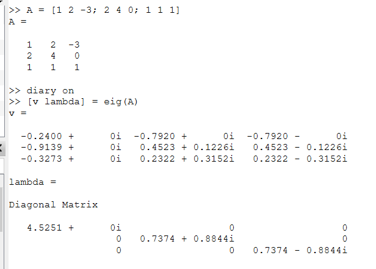

---
## Front matter
title: "Лабораторная работа №8"
subtitle: "Информационная безопасность"
author: "Николаев Дмитрий Иванович"

## Generic otions
lang: ru-RU
toc-title: "Содержание"

## Bibliography
bibliography: bib/cite.bib
csl: pandoc/csl/gost-r-7-0-5-2008-numeric.csl

## Pdf output format
toc: true # Table of contents
toc-depth: 2
lof: true # List of figures
lot: true # List of tables
fontsize: 12pt
linestretch: 1.5
papersize: a4
documentclass: scrreprt
## I18n polyglossia
polyglossia-lang:
  name: russian
  options:
	- spelling=modern
	- babelshorthands=true
polyglossia-otherlangs:
  name: english
## I18n babel
babel-lang: russian
babel-otherlangs: english
## Fonts
mainfont: PT Serif
romanfont: PT Serif
sansfont: PT Sans
monofont: PT Mono
mainfontoptions: Ligatures=TeX
romanfontoptions: Ligatures=TeX
sansfontoptions: Ligatures=TeX,Scale=MatchLowercase
monofontoptions: Scale=MatchLowercase,Scale=0.9
## Biblatex
biblatex: true
biblio-style: "gost-numeric"
biblatexoptions:
  - parentracker=true
  - backend=biber
  - hyperref=auto
  - language=auto
  - autolang=other*
  - citestyle=gost-numeric
## Pandoc-crossref LaTeX customization
figureTitle: "Рис."
tableTitle: "Таблица"
listingTitle: "Листинг"
lofTitle: "Список иллюстраций"
lotTitle: "Список таблиц"
lolTitle: "Листинги"
## Misc options
indent: true
header-includes:
  - \usepackage{indentfirst}
  - \usepackage{float} # keep figures where there are in the text
  - \floatplacement{figure}{H} # keep figures where there are in the text
---

# Цель работы

Освоить на практике применение режима однократного гаммирования на примере кодирования различных исходных текстов одним ключом.

# Теоретическое введение

Шифротексты двух телеграмм (исходные сообщения) можно получить по формулам режима однократного гаммирования:
\begin{equation}
\label{eq:1}
C_1 = P_1 \bigoplus K,
C_2 = P_2 \bigoplus K,
\end{equation}
где $C_i$ --- шифротексты, $P_i$ --- открытые (исходные) тексты, $i = 1, 2$, $K$ --- единый ключ шифрования.

Открытый текст можно найти в соответствии с (\ref{eq:1}), зная шифротекст двух телеграмм, зашифрованных одним ключом. Для это оба равенства (\ref{eq:1}) складываются по модулю 2. Тогда с учётом свойства операции XOR
\begin{equation}
\label{eq:2}
1 \bigoplus 1 = 0,
1 \bigoplus 0 = 1
\end{equation}
получаем:
$$
C_1 \bigoplus C_2 = P_1 \bigoplus K \bigoplus P_2 \bigoplus K = P_1 \bigoplus P_2,
C_1 \bigoplus C_2 = P_1 \bigoplus P_2.
$$

Предположим, что одна из телеграмм является шаблоном --- т.е. имеет текст фиксированного формата, в который вписываются значения полей. Допустим, что злоумышленнику этот формат известен. Тогда он получает достаточно много пар $C_1 \bigoplus C_2$ (известен вид обеих шифровок). Тогда зная $P_1$ и учитывая (\ref{eq:2}), имеем:
\begin{equation}
\label{eq:3}
C_1 \bigoplus C_2 \bigoplus P_1 = P_1 \bigoplus P_2 \bigoplus P_1 = P_2.
\end{equation}

Таким образом, злоумышленник получает возможность определить те символы сообщения $P_2$, которые находятся на позициях известного шаблона сообщения $P_1$. В соответствии с логикой сообщения $P_2$, злоумышленник имеет реальный шанс узнать ещё некоторое количество символов сообщения $P_2$. Затем вновь используется (\ref{eq:3}) с подстановкой вместо $P_1$ полученных на предыдущем шаге новых символов сообщения $P_2$. И так далее. Действуя подобным образом, злоумышленник даже если не прочитает оба сообщения, то значительно уменьшит пространство их поиска [-@lab8].

# Выполнение лабораторной работы

Два текста кодируются одним ключом (однократное гаммирование). Требуется не зная ключа и не стремясь его определить, прочитать оба текста. Необходимо разработать приложение, позволяющее шифровать и дешифровать тексты $P_1$ и $P_2$ в режиме однократного гаммирования. Приложение должно определить вид шифротекстов $C_1$ и $C_2$ обоих текстов $P_1$ и $P_2$ при известном ключе. Необходимо определить и выразить аналитически способ, при котором злоумышленник может прочитать оба текста, не зная ключа и не стремясь его определить.

Имеем две телеграммы: $P_1$ = "На Ваш исходящий от 1204" и $P_2$ = " в Северный филиал Банка". Используя функции из предыдущей лабораторной и выбрав произвольный ключ, найдём значения обоих шифротекстов. После этого реализуем функцию, которая по обоим известным шифротекстам и одному из сообщений находит второе сообщение. Результат работы программы представлен на ([-@fig:001]).

Так как в программе реализован собственный словарь (длины 81), то рассматривается не операция исключающего ИЛИ, а модульная арифметика по основанию длины словаря ($N = 81$). Так, для реализации описанной выше функции, вместо
\begin{equation}
\label{eq:3}
C_1 \bigoplus C_2 \bigoplus P_1 = P_1 \bigoplus P_2 \bigoplus P_1 = P_2.
\end{equation}
имеем следующие выражения
\begin{equation}
C_1 + C_2 \equiv P_1 + K + P_2 + K \equiv P_1 + P_2 + 2K \pmod{N},
\end{equation}
\begin{equation}
C_i \equiv P_i + K \pmod{N},\quad i = 1, 2
\end{equation}
\begin{equation}
C_1 + C_2 \equiv P_1 + (C_2 - K) + 2K \equiv P_1 + C_2 + K \pmod{N},
\end{equation}
\begin{equation}
P_2 \equiv C_2 - K \equiv C_2 - (C_1 + C_2 - P_1 - C_2) \equiv C_2 - (C_1 - P_1) \pmod{N}.
\end{equation}
В итоге имеем выражение (\ref{eq:mod})
\begin{equation}
\label{eq:mod}
P_2 \equiv C_2 - C_1 + P_1 \pmod{N}.
\end{equation}
где $N = 81$ --- длина словаря, $K$ --- код ключа, $P_1$ --- код первого исходного сообщения, $P_2$ --- код второго исходного сообщения, $C_1$ --- код первого зашифрованного сообщения, $C_2$ --- код второго зашифрованного сообщения; остаток 0 означает последний элемент словаря.

Ниже представлен код реализации на Julia:

```Julia
include("C:/Users/User/Documents/work/study/2022-2023/
Информационная безопасность/infosec/labs/lab07/report/report/gamma.jl")

function Gamma_Hijack_Message(Source_Message_1::String, 
Encrypted_Message_1::String, Encrypted_Message_2::String)::String
    n1 = length(Source_Message_1)  # Длина исходного сообщения 1
    n2 = length(Encrypted_Message_1)
    n3 = length(Encrypted_Message_2)
    println("Первое исходное сообщение - ", Source_Message_1)
    println("Первое зашифрованное сообщение - ", Encrypted_Message_1)
    println("Второе зашифрованное сообщение - ", Encrypted_Message_2)
    n1 != n2 != n3  ? println("Несоответсвие размерности исходного и 
    зашифрованных сообщений") : skip
    Source_Code_1 = []
    Encrypted_Code_1 = []
    Encrypted_Code_2 = []
    for i in Source_Message_1
        push!(Source_Code_1, Dictionary[i])
    end
    for i in Encrypted_Message_1
        push!(Encrypted_Code_1, Dictionary[i])
    end
    for i in Encrypted_Message_2
        push!(Encrypted_Code_2, Dictionary[i])
    end
    println("Код первого исходного сообщения - ", Source_Code_1)
    println("Код первого зашифрованного сообщения - ", Encrypted_Code_1)
    println("Код второго зашифрованного сообщения - ", Encrypted_Code_2)
    Source_Code_2 = []   # Код второго исходного сообщения
    for i in range(1, n1)
        a = Encrypted_Code_2[i] - Encrypted_Code_1[i] + Source_Code_1[i]
        a <= 0 ? a += N : skip
        a > N ? a %= N : skip 
        push!(Source_Code_2, a)
    end
    println("Код второго исходного сообщения - ", Source_Code_2)
    Source_Message_2 = ""
    for i in Source_Code_2
        Source_Message_2 *= Dictionary2[i]
    end
    println("Второе исходное сообщение - ", Source_Message_2)
    return Source_Message_2
end


P1 = "На Ваш исходящий от 1204"  # 24 символа
P2 = " в Северный филиал Банка"
Initial_Key = "АБВГДЕжзийклмнопрстуфхЦЧ"

println("Находим первое зашифрованное сообщение")
C1 = Gamma_Find_Encrypted_Text(P1, Initial_Key) # тексты зашифрованных сообщений
println("Находим второе зашифрованное сообщение")
C2 = Gamma_Find_Encrypted_Text(P2, Initial_Key)


println("Находим второе сообщение по известным шифротекстам и первому 
сообщению без использования ключа")
Hijacked_P2 = Gamma_Hijack_Message(P1, C1, C2)

if P2 == Hijacked_P2
    println("Взлом второго сообщения прошел успешно!")
else
    println("Неудача")
end
```

{#fig:001 width=70%}

# Ответы на вопросы

1. Как, зная один из текстов ($P_1$ или $P_2$), определить другой, не зная при этом ключа?

    С помощью формулы
    $$
    C_1 \bigoplus C_2 \bigoplus P_1 = P_1 \bigoplus P_2 \bigoplus P_1 = P_2,
    $$
    где $C_1$ и $C_2$ --- шифротексты двух исходных текстов.

2. Что будет при повторном использовании ключа при шифровании текста?

    Мы получим исходное сообщение.

3. Как реализуется режим шифрования однократного гаммирования одним ключом двух открытых текстов?

    С помощью формул
    $$
    C_1 = P_1 \bigoplus K,
    C_2 = P_2 \bigoplus K,
    $$
    где $C_i$ --- шифротексты, $P_i$ --- открытые (исходные) тексты, $i = 1, 2$, $K$ --- единый ключ шифрования.

4. Перечислите недостатки шифрования одним ключом двух открытых текстов.

    1) Имея на руках одно из сообщений в открытом виде и оба шифротекста, злоумышленник способен расшифровать каждое сообщение, не зная ключа.
    2) Зная шаблон сообщений, злоумышленник получает возможность определить те символы сообщения $P_2$, которые находятся на позициях известного шаблона сообщения $P_1$, то есть сильно сокращает возможные варианты для перебора.
    3) Зная ключ, злоумышленник сможет расшифровать все сообщения, которые были закодированы при его помощи.

5. Перечислите преимущества шифрования одним ключом двух открытых текстов.

    1) Данный способ помогает упростить процесс шифрования и дешифровки.
    2) При отправке сообщений между двумя компьютерами, удобнее пользоваться одним общим ключом для передаваемых данных.

# Выводы

В ходе выполнения лабораторной работы я освоил на практике применение режима однократного гаммирования на примере кодирования различных исходных текстов одним ключом.

# Список литературы{.unnumbered}

::: {#refs}
:::
